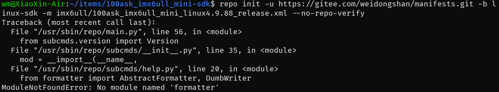
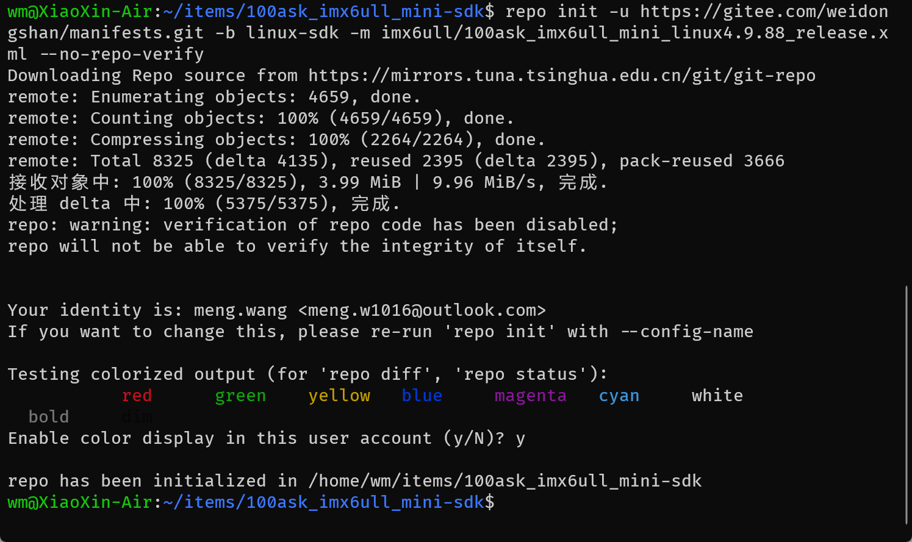
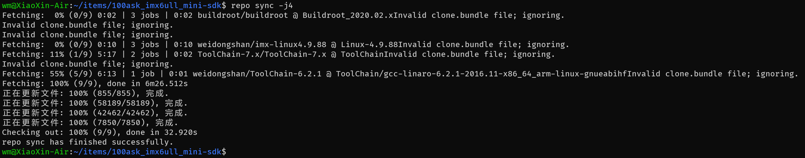
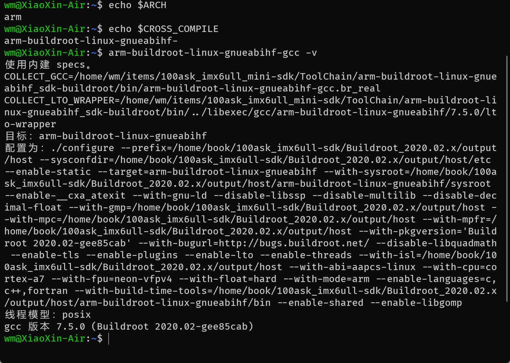

# 下载 BSP 及配置交叉编译工具链

100ask_imx6ull 开发板的 BSP 都保存在 git 站点上，通过 repo 命令进行统一管理。

## 配置 repo

下载 repo 工具前需要设置 git 的邮箱和用户名

``` bash
~$ git config --global user.name "meng.wang"
~$ git config --global user.email "meng.w1016@outlook.com"

# 检查是否设置成功
~$ git config --list
user.name=meng.wang
user.email=meng.w1016@outlook.com
```

 

## 下载 BSP

### 教程方案

通过 repo 管理多个 git 仓库中的源码，可以及时更新最新代码。

克隆 repo 到 `/usr/sbin` 目录下：

``` bash
~$ sudo git clone https://e.coding.net/codebug8/repo.git /usr/sbin
```

添加到环境变量：

``` bash
~$ export PATH=$PATH:/usr/sbin/repo
# 使环境变量生效
~$ source ~/.bashrc
# 检查是否生效
~$ repo --version
<repo not installed>
repo launcher version 2.8
       (from /usr/sbin/repo/repo)
git 2.34.1
Python 3.10.12 (main, Jun 11 2023, 05:26:28) [GCC 11.4.0]
OS Linux 6.2.0-26-generic (#26~22.04.1-Ubuntu SMP PREEMPT_DYNAMIC Thu Jul 13 16:27:29 UTC 2)
CPU x86_64 (x86_64)
```

生成项目目录并进入：

``` bash
~/items$ mkdir -p 100ask_imx6ull_mini-sdk && cd 100ask_imx6ull_mini-sdk
```

初始化该仓库：

``` bash
~/items/100ask_imx6ull_mini-sdk$ repo init -u https://gitee.com/weidongshan/manifests.git -b linux-sdk -m imx6ull/100ask_imx6ull_mini_linux4.9.88_release.xml --no-repo-verify
```

接下来遇到了一个错误，



在网上查找原因：

> formatter已经在python3.4标记成废弃接口，在python3.10已经正式删除，并且其依赖的cStringIO也已经删除

按照以上方案，到这里暂时停滞了，没有找到解决该报错的方案。

不过为了总结经验教训，还是把以上记录下来。


### 新方案

首先下载 repo：

``` bash
curl https://mirrors.tuna.tsinghua.edu.cn/git/git-repo -o repo

# 给 repo 赋予可执行权限
chmod +x repo
```

repo的运行过程中会尝试访问官方的git源更新自己，如果想使用tuna的镜像源进行更新，可以将如下内容复制到你的`~/.bashrc`里

``` bash
export REPO_URL='https://mirrors.tuna.tsinghua.edu.cn/git/git-repo'

# 使配置生效
source ~/.bashrc
```

生成项目目录并进入：

``` bash
~/items$ mkdir -p 100ask_imx6ull_mini-sdk && cd 100ask_imx6ull_mini-sdk
```

初始化该仓库：

``` bash
~/items/100ask_imx6ull_mini-sdk$ repo init -u https://gitee.com/weidongshan/manifests.git -b linux-sdk -m imx6ull/100ask_imx6ull_mini_linux4.9.88_release.xml --no-repo-verify
```

执行成功的结果如下图：



下载 IMX6ULL Miin 版源码：

``` bash
~/items/100ask_imx6ull_mini-sdk$ repo sync -j4
```

等待十几分钟（取决于网络），下载成功结果如下：



同步更新最新代码，可以先进入该文件夹，然后执行

``` bash
~$ repo sync -c
```


## 配置交叉编译工具链

交叉编译工具链用来在 Ubuntu 主机上编译应用程序，而这些应用程序是在 ARM 等其他平台上运行。 设置交叉编译工具主要是设置 `PATH`， `ARCH` 和 `CROSS_COMPILE` 三个环境变 量，下面介绍具体设置方法

如需永久修改，修改用户配置文件：

``` bash
~$ sudo vim ~/.bashrc
```

在行尾添加或修改，加上下面几行：

``` bash
export ARCH=arm

export CROSS_COMPILE=arm-buildroot-linux-gnueabihf-

export PATH=$PATH:/home/wm/items/100ask_imx6ull_mini-sdk/ToolChain/arm-buildroot-linux-gnueabihf_sdk-buildroot/bin
```

其中第三项，你应该自己查找确认一下自己的该目录具体位置，使用你自己的配置。

设置完毕后，执行如下命令使其生效：

``` bash
~$ source ~/.bashrc
```

## 测试交叉编译工具链

``` bash
~$ echo $ARCH
~$ echo $CROSS_COMPILE
~$ arm-buildroot-linux-gnueabihf-gcc -v
```



