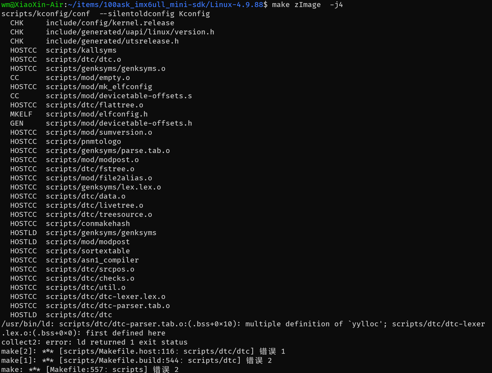
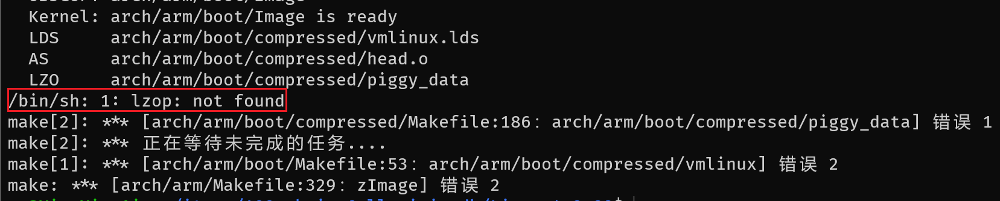
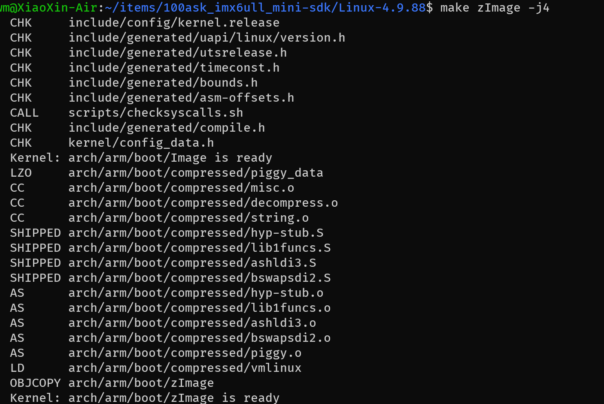
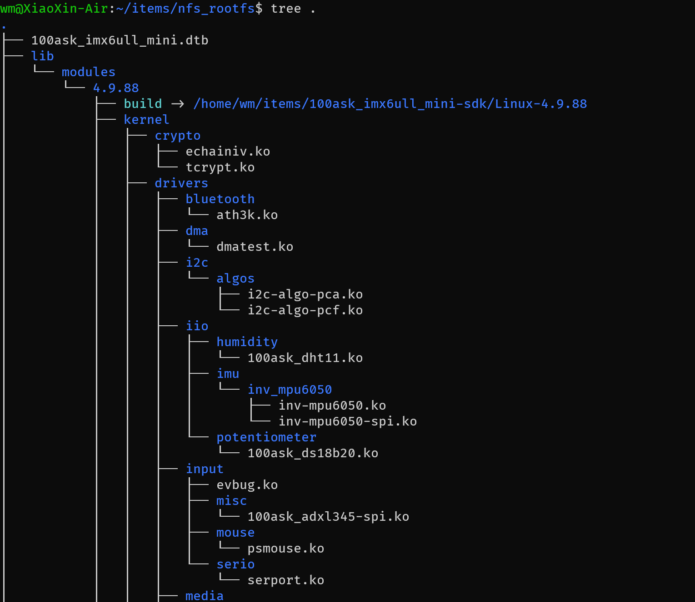
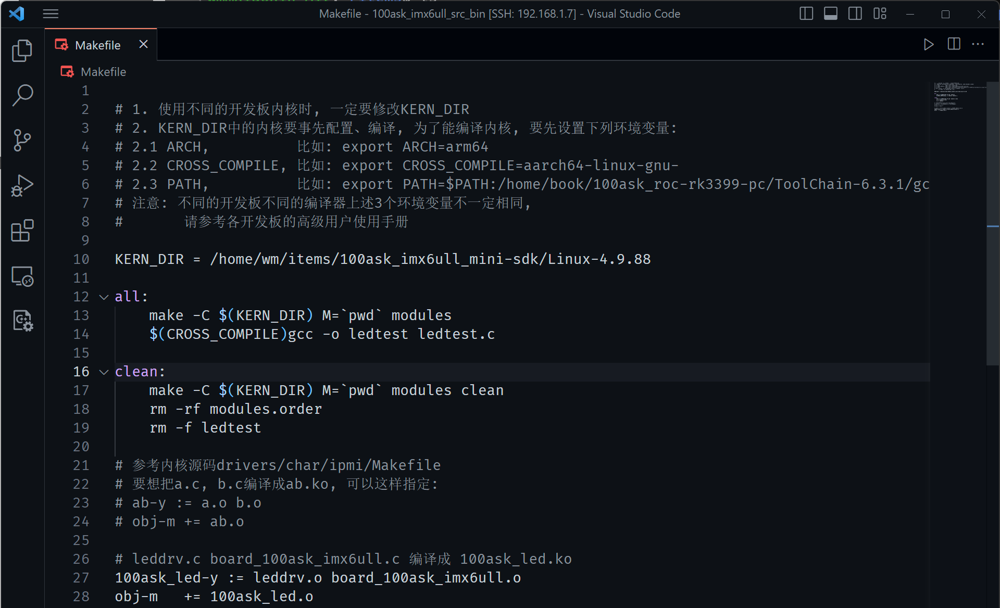

# 开发板的第一个驱动实验

编译驱动程序之前要先编译内核。

- **驱动程序要用到内核文件：**

比如驱动程序中这样包含头文件：`#include<asm/io.h>` ，其中的 `asm` 是一个链接文件，指向 `asm-arm` 或 `asm-mips`，这需要先配置、编译内核才会生成 `asm` 这个链接文件。

- **编译驱动时用的内核、开发板上运行的内核，要一致：**

开发板上运行到内核是出厂时烧录的，你编译驱动时用的内核是你自己编译的，这两个内核不一致时会导致一些问题。所以我们编译驱动程序前，要把自己编译出来到内核放到板子上去，替代原来的内核。

- **更换板子上的内核后，板子上的其他驱动也要更换：**

板子使用新编译出来的内核时，板子上原来的其他驱动也要更换为新编译出来的。所以在编译我们自己的第 1 个驱动程序之前，要先编译内核、模块，并且放到板子上去。

## 准备工作

### 编译内核

不同的开发板对应不同的配置文件 ， 配置文件位于内核源码 `arch/arm/configs/ `目录。kernel 的编译过程如下：

``` bash
$ cd 100ask_imx6ull_mini-sdk/Linux-4.9.88/
$ make mrproper
$ make 100ask_imx6ull_mini_defconfig
$ make zImage -j4
```

执行到编译内核这一步就报下面的错误了。



问题就是由于 `scripts/dtc/dtc-parser.tab.c` 和 `scripts/dtc/dtc-lexer.lex.c` 中多次定义了重复的变量，解决方案可以将  `scripts/dtc/dtc-parser.tab.c`  中的 `yylloc` 变量定义注释掉。

不过再次编译又报错 `/bin/sh: 1: lzop: not found`



解决方案：下载安装 `lzop` 库。

``` bash
sudo apt-get install lzop
```

再次编译即可成功生成 `zImage` 。




### 编译设备树

编译指令如下：

``` bash
~/items/100ask_imx6ull_mini-sdk/Linux-4.9.88$ make dtbs
```

编译完成后，在 `arch/arm/boot` 目录下生成 `zImage` 内核文件，在 `arch/arm/boot/dts` 目录下生成设备树的二进制文件 `100ask_myir_imx6ull_mini.dtb` 。

### 编译内核模块

进入内核源码目录后，就可以编译内核模块了：

``` bash
~/items/100ask_imx6ull_mini-sdk/Linux-4.9.88$ make modules
```

### 安装内核模块到 ubuntu 某个目录下备用

``` bash
# 这个目录看个人，我是需要一个目录单独来放编译的内核模块
~/items/100ask_imx6ull_mini-sdk/Linux-4.9.88$ mkdir ~/items/nfs_rootf
~/items/100ask_imx6ull_mini-sdk/Linux-4.9.88$ make ARCH=arm INSTALL_MOD_PATH=/home/wm/items/nfs_rootfs modules_install

# 将编译的 zImage 模块和设备树文件存放在 nfs_rootf 目录下
~/items/100ask_imx6ull_mini-sdk/Linux-4.9.88/arch/arm/boot$ cp zImage ~/items/nfs_rootfs/
~/items/100ask_imx6ull_mini-sdk/Linux-4.9.88/arch/arm/boot$ cp dts/100ask_imx6ull_mini.dtb ~/i
tems/nfs_rootfs/
```

安装好驱动后的 `/home/wm/items/nfs_rootfs/` 目录结构如图所示：



### 安装内核和模块到开发板

接下来要把这些文件复制到开发板上，在开发板上执行以下命令：

``` bash
[root@100ask:~]# cp /mnt/nfs_rootfs/zImage /boot
[root@100ask:~]# cp /mnt/nfs_rootfs/100ask_imx6ull_mini.dtb /boot
[root@100ask:~]# cp /mnt/nfs_rootfs/lib/modules /lib -rfd

# 重启前查询
[root@100ask:~]# uname -a
Linux 100ask 4.9.88 #1 SMP PREEMPT Sat Aug 27 03:42:04 EDT 2022 armv7l GNU/Linux
# 重启开发板，使得新的zImage、dtb、模块生效
[root@100ask:~]# reboot
[root@100ask:~]# uname -a
Linux 100ask 4.9.88 #1 SMP PREEMPT Sun Aug 27 18:44:26 CST 2023 armv7l GNU/Linux
```

## 编译 led 驱动

打开 `01_all_series_quickstart/05_嵌入式Linux驱动开发基础知识/source/02_led_drv/02_led_drv_for_boards/100ask_imx6ull_src_bin` 目录，修改 `Makefile` 文件的 `KERN_DIR` 为自己放置内核文件的路径，根据个人实际情况进行修改。



修改完内核所在目录后，就可以编译 led 模块驱动了。

``` bash
$ make all
```

编译完成后会生成 `100ask_led.ko` 和 `ledtest` 两个文件：

此时，把这两个文件拷贝到 nfs_rootfs 目录下备用。

``` bash
$ cp 100ask_led.ko ledtest ~/items/nfs_rootfs/
```

## 在开发板上安装驱动模块

### 下载驱动程序

开发板启动后通过 nfs 挂载 Ubuntu 目录的方式，将相应的文件拷贝到开发板内。

``` bash
[root@100ask:~]# mount -t nfs -o nolock,vers=3 192.168.5.11:/home/book/nfs_rootfs /mnt
[root@100ask:/mnt]# cp /mnt/nfs_rootfs/100ask_led.ko ./
[root@100ask:/mnt]# cp /mnt/nfs_rootfs/ledtest ./
```

### 安装驱动模块

在开发板串口终端上执行如下命令，即可安装相应的驱动模块。

``` bash
[root@100ask:~]# insmod 100ask_led.ko
[ 1820.664075] 100ask_led: loading out-of-tree module taints kernel.
```

安装完成后可以执行 `lsmod` 命令来查看是否安装成功

``` bash
[root@100ask:~]# lsmod
Module                  Size  Used by
100ask_led              3351  0
inv_mpu6050_spi         2052  0
inv_mpu6050            11012  2 inv_mpu6050_spi
evbug                   2078  0
100ask_adxl345_spi      3963  0
100ask_spidev           9333  0
100ask_irda             3442  0
100ask_rc_nec           1146  0
100ask_dht11            3948  0
100ask_ds18b20          4174  0
```

## 执行测试程序

驱动模块安装成功后，就可以使用测试程序来控制 led 灯的状态。操作 led 灯时可同时观察开发板串口旁的灯是否有亮灭的变化。

``` bash
[root@100ask:~]# chmod +x ./ledtest
[root@100ask:~]# ./ledtest
Usage: ./ledtest <dev> <on | off>
[root@100ask:~]# ./ledtest /dev/100ask_led0 on    // 打开 led0 
[root@100ask:~]# ./ledtest /dev/100ask_led0 on    // 关闭 led0
```

