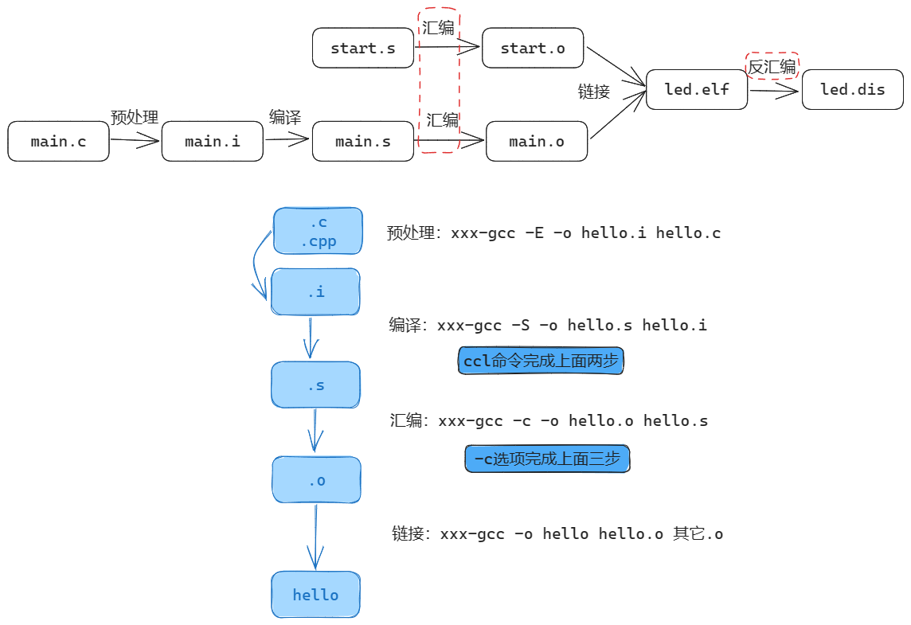

# GCC 编译器

## GCC 的编译过程

一个 C/C++ 文件要经过 **预处理（preprocessing）**、**编译（compilation）**、**汇编（assembly）**和 **链接（linking）**等 4 步才能变成可执行文件。



gcc 使用示例：

``` bash
gcc hello.c 					// 输出一个名为 a.out 的可执行程序，然后可以执行./a.out
gcc -o hello hello.c 			// 输出名为 hello 的可执行程序，然后可以执行./hello
gcc -o hello hello.c -static 	// 静态链接
gcc -c -o hello.o hello.c 		// 先编译(不链接)
gcc -o hello hello.o 			// 再链接
```

执行 `gcc -o hello hello.c -v` 时，可以查看到这些步骤：

``` bash
cc1 main.c -o /tmp/ccXCx1YG.s
as -o /tmp/ccZfdaDo.o /tmp/ccXCx1YG.s
cc1 sub.c -o /tmp/ccXCx1YG.s
as -o /tmp/ccn8Cjq6.o /tmp/ccXCx1YG.s
collect2 -o test /tmp/ccZfdaDo.o /tmp/ccn8Cjq6.o ....
```

### 常用编译选项

| 常用选项 | 描述                                               |
| :------: | -------------------------------------------------- |
|    -E    | 预处理，开发过程中想快速确定某个宏可以使用“-E -dM” |
|    -c    | 把预处理、编译、汇编都做了，但是不链接             |
|    -o    | 指定输出文件                                       |
|    -I    | 指定头文件目录                                     |
|    -L    | 指定链接时库文件目录                               |
|    -l    | 指定链接哪一个库文件                               |

### 编译多个文件

-  一起编译

``` bash
gcc -o test main.c sub.c
```

- 分开编译

``` bash
gcc -c -o mian.o mian.c
gcc -c -o sub.o sub.c
gcc -o test main.o sub.o
```

### 制作动态库

1. **制作、编译**

``` bash
gcc -c -o main.o main.c
gcc -c -o sub.o sub.c
gcc -shared -o libsub.so sub.o sub2.o sub3.o (可以使用多个.o生成动态库)
gcc -o test main.o -lsub -L /libsub.so/所在目录
```

2. **运行**

- 先把 libsub.so 放到 Ubuntu 的/lib 目录，然后就可以运行 test 程序。
- 如果不想把 libsub.so 放到/lib，也可以放在某个目录比如/a，然后如下执行：

``` bash
export LD_LIBRARY_PATH=$LD_LIBRARY_PATH:/a
./test
```

### 制作、使用静态库

``` bash
gcc -c -o main.o main.c
gcc -c -o sub.o sub.c
ar crs libsub.a sub.o sub2.o sub3.o(可以使用多个.o 生成静态库)
gcc -o test main.o libsub.a (如果.a 不在当前目录下，需要指定它的绝对或相对路径)
```

运行：不需要把静态库 libsub.a 放到板子上。

注意：执行 arm-buildroot-linux-gnueabihf-gcc -c -o sub.o sub.c 交叉编译需要在 最后面加上-fPIC 参数。


### 有用的选项

``` bash
gcc -E main.c // 查看预处理结果，比如头文件是哪个
gcc -E -dM main.c > 1.txt // 把所有的宏展开，存在 1.txt 里
gcc -Wp,-MD,abc.dep -c -o main.o main.c // 生成依赖文件 abc.dep，后面 Makefile 会用
echo 'main(){}'| gcc -E -v - // 它会列出头文件目录、库目录(LIBRARY_PATH)
```

