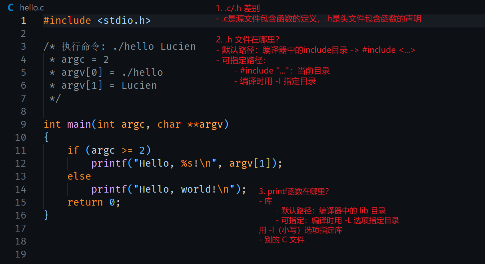

# HelloWorld 的背后

## 交叉编译

hello.c 的源码如下：

``` c
#include <stdio.h>

/* 执行命令: ./hello Lucien 
 * argc = 2
 * argv[0] = ./hello
 * argv[1] = Lucien
 */

int main(int argc, char **argv)
{
	if (argc >= 2)
		printf("Hello, %s!\n", argv[1]);
	else
		printf("Hello, world!\n");
	return 0;
}
```

在 ubuntu 中执行以下命令编译、运行：

``` bash
$ gcc -o hello hello.c
$ ./hello
Hello, world!

$ ./hello Lucien
Hello, Lucien!
```

上面通过 gcc 编译得到的可执行程序只能在 x86 平台上运行，如果需要在 ARM 平台上运行则需要使用如下交叉编译链。

``` bash
$ arm-buildroot-linux-gnueabihf-gcc -o hello hello.c
```

将上面编译得到的可执行程序复制到 ARM 开发板，如下运行：

``` bash
[root@100ask:~]# ./hello
Hello, world!
[root@100ask:~]# ./hello Lucien
Hello, Lucien!
```

## 解疑答惑



- 怎么确定交叉编译器中头文件的默认路径？

进入交叉编译器的目录里，执行：find -name “stdio.h”，它位于一个 “include”目录下的根目录里。这个“include”目录，就是要找的路径。

- 怎么自己指定头文件目录？

编译时，加上“-I <头文件目录>”这样的选项。

- 怎么确定交叉编译器中库文件的默认路径？

进入交叉编译器的目录里，执行：find -name lib，可以得到 xxxx/lib、 xxxx/usr/lib，一般来说这 2 个目录就是要找的路径。如果有很多类似的 lib， 进去看看，有很多 so 文件的目录一般就是要找的路径。

- 怎么自己指定库文件目录、指定要用的库文件？

  - 编译时，加上“-L <库文件目录>”这样的选项，用来指定库目录； 

  - 编译时，加上“-labc”这样的选项，用来指定库文件 libabc.so
